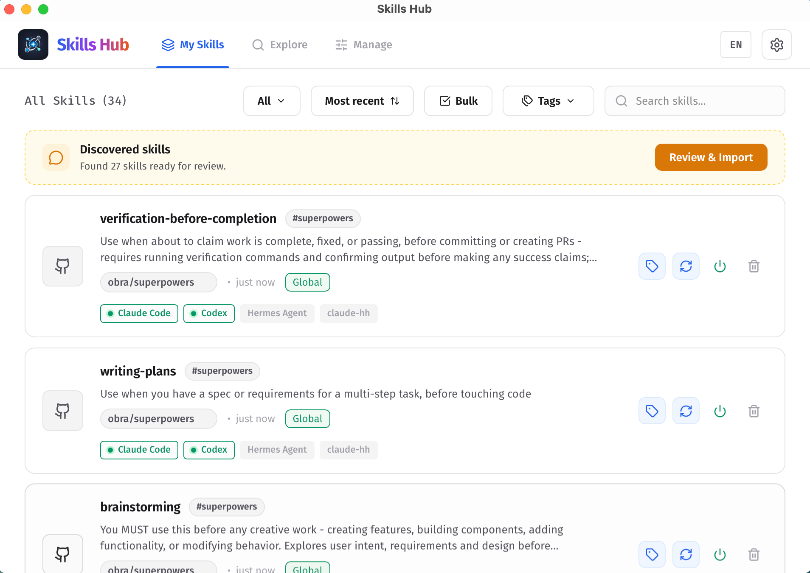
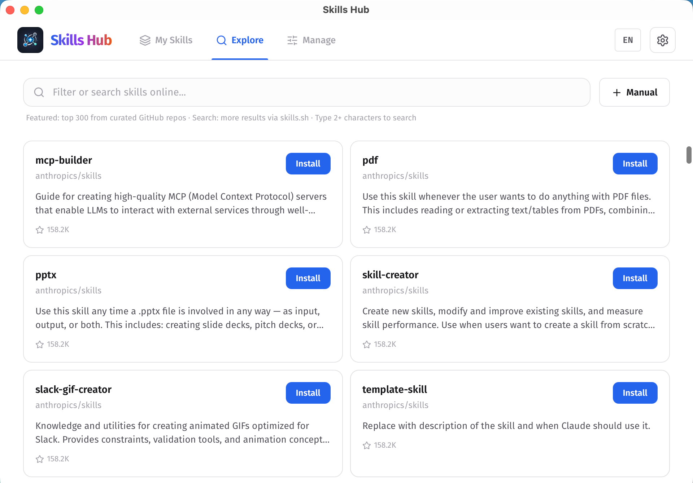
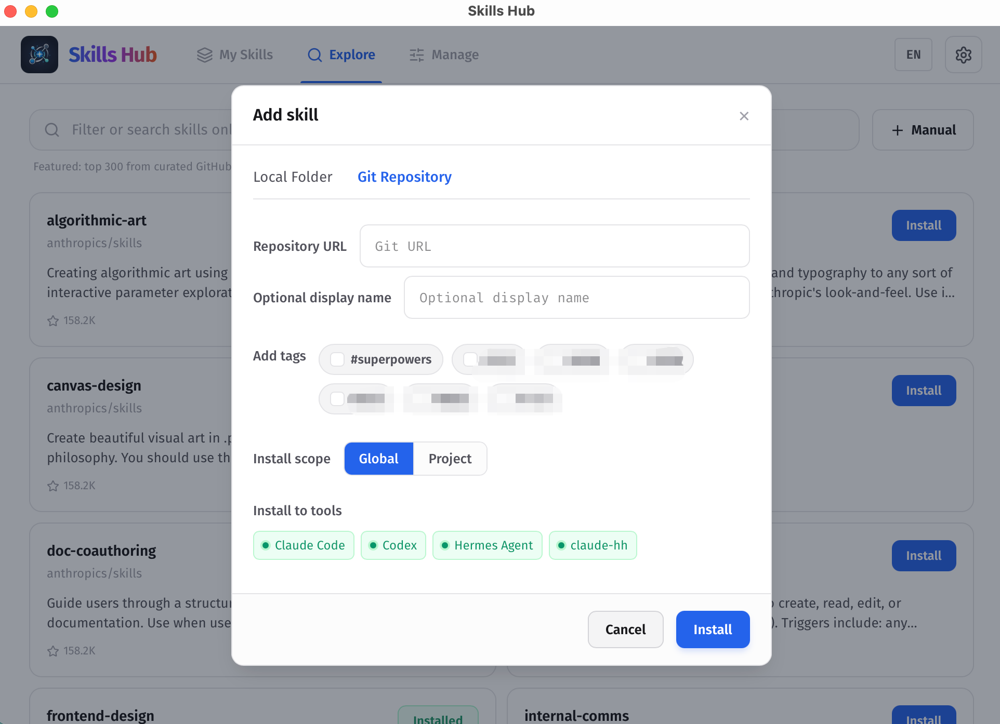
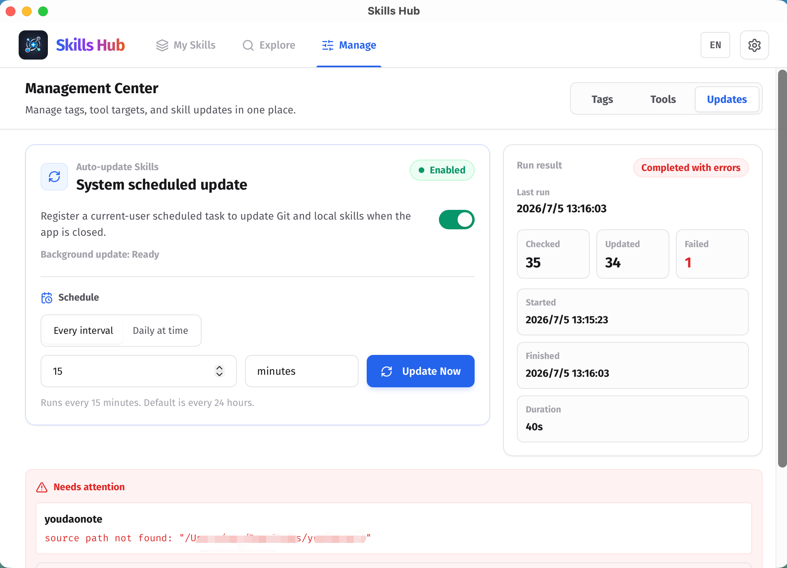
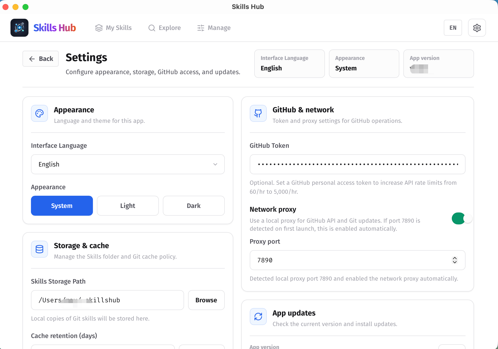

# Skills Hub (Tauri Desktop)

A cross-platform desktop app (Tauri + React) for installing, organizing, updating, and syncing Agent Skills to multiple AI coding tools' global or project-level skills directories. Skills Hub prefers symlink/junction and automatically falls back to copy when needed: "Install once, sync everywhere".

## Documentation

- English (default): `README.md` (this file)
- 中文：[`docs/README.zh.md`](docs/README.zh.md)

## Why Skills Hub

AI coding tools increasingly use their own skills directories and installation flows. Maintaining those directories manually can quickly become messy: the same skill gets copied many times, update sources become unclear, tool activation states drift, and bulk cleanup takes too much effort.

Skills Hub installs skills into one central repository, then syncs them to tools such as Claude Code, Codex, Cursor, OpenCode, and Antigravity based on your choices. You can tag skills, choose global or project scope, update tool targets in bulk, and let the system update Git and local-source skills on a schedule.

## Key Features

- **Centralized library**: Install skills into one central repository instead of scattering copies across tool folders.
- **Explore and install**: Install from curated lists, online search, local folders, or Git repositories.
- **Multi-tool sync**: Sync skills to different AI coding tools by global or project scope.
- **Bulk management**: Apply tags, tool targets, enabled state, or delete operations to many skills at once.
- **Tag organization**: Filter, group, and maintain skills with tags.
- **Tool management**: Enable built-in tool targets or add custom skills directories.
- **Automatic updates**: Update Git and local-source skills on a schedule, with visible failure details.
- **Detail view**: Browse skill file trees, Markdown content, and code snippets.
- **Migration**: Scan and import existing local skills into one managed library.

## Interface Preview

### My Skills — Managed Skills and Bulk Actions

My Skills shows each managed skill's source, tags, sync scope, target tools, and enabled state. The toolbar supports scope filtering, sorting, bulk mode, tag filtering, and search.



### Explore — Curated Skills and Online Search

Explore brings together curated repository skills and online search. After clicking Install, you can choose tags, install scope, and target tools.



### Add Skill — Set Tags, Scope, and Tools Before Installation

Manual add supports both local folders and Git repositories. Before installing, you can assign tags, choose global or project scope, and choose which tools to sync to.



### Management Center — Tags, Tools, and Updates

Management Center keeps tag management, tool targets, and update scheduling in one place. The Updates page supports scheduled updates, manual updates, run summaries, and failure details.



### Settings — App-Level Preferences

Settings keeps app-level preferences such as interface language, appearance, storage and cache, GitHub token, network proxy, and app updates.



## Workflow

1. Install a skill from Explore, a local folder, or a Git repository.
2. Choose tags, sync scope, and target tools before installation.
3. Skills Hub stores the skill in the central repository, which defaults to `~/.skillshub`.
4. Skills Hub syncs it to global skills directories or project-level skills directories based on each tool's rules.
5. Later, you can organize, enable/disable, delete, or bulk update skills from My Skills, and configure tool targets or automatic updates from Management Center.

## Supported AI Coding Tools

Skills Hub includes 46 built-in tool adapters and supports custom skills directories from Management Center. Project skills directories are relative to the selected project root. Tools marked `N/A` do not have a confirmed project-level skills directory and are supported for global sync only.

| tool key | Display name | global skills dir (relative to `~`) | project skills dir (relative to project) | detected if exists (relative to `~`) |
| --- | --- | --- | --- | --- |
| `cursor` | Cursor | `.cursor/skills` | `.agents/skills` | `.cursor` |
| `claude_code` | Claude Code | `.claude/skills` | `.claude/skills` | `.claude` |
| `codex` | Codex | `.codex/skills` | `.agents/skills` | `.codex` |
| `opencode` | OpenCode | `.config/opencode/skills` | `.agents/skills` | `.config/opencode` |
| `antigravity` | Antigravity | `.gemini/config/skills` | `.agents/skills` | `.gemini/config` |
| `amp` | Amp | `.config/agents/skills` | `.agents/skills` | `.config/agents` |
| `kimi_cli` | Kimi Code CLI | `.config/agents/skills` | `.agents/skills` | `.config/agents` |
| `augment` | Augment | `.augment/skills` | `.augment/skills` | `.augment` |
| `openclaw` | OpenClaw | `.openclaw/skills` | `skills` | `.openclaw` |
| `copaw` | Copaw | `.copaw/skill_pool` | `.copaw/skill_pool` | `.copaw` |
| `cline` | Cline | `.agents/skills` | `.agents/skills` | `.agents` |
| `codebuddy` | CodeBuddy | `.codebuddy/skills` | `.codebuddy/skills` | `.codebuddy` |
| `codewhale` | CodeWhale | `.codewhale/skills` | `.codewhale/skills` | `.codewhale` |
| `workbuddy` | WorkBuddy | `.workbuddy/skills` | `N/A` | `.workbuddy` |
| `command_code` | Command Code | `.commandcode/skills` | `.commandcode/skills` | `.commandcode` |
| `continue` | Continue | `.continue/skills` | `.continue/skills` | `.continue` |
| `crush` | Crush | `.config/crush/skills` | `.crush/skills` | `.config/crush` |
| `junie` | Junie | `.junie/skills` | `.junie/skills` | `.junie` |
| `iflow_cli` | iFlow CLI | `.iflow/skills` | `.iflow/skills` | `.iflow` |
| `kiro_cli` | Kiro CLI | `.kiro/skills` | `.kiro/skills` | `.kiro` |
| `kode` | Kode | `.kode/skills` | `.kode/skills` | `.kode` |
| `mcpjam` | MCPJam | `.mcpjam/skills` | `.mcpjam/skills` | `.mcpjam` |
| `mistral_vibe` | Mistral Vibe | `.vibe/skills` | `.vibe/skills` | `.vibe` |
| `mux` | Mux | `.mux/skills` | `.mux/skills` | `.mux` |
| `openclaude` | OpenClaude IDE | `.openclaude/skills` | `.openclaude/skills` | `.openclaude` |
| `openhands` | OpenHands | `.openhands/skills` | `.openhands/skills` | `.openhands` |
| `pi` | Pi | `.pi/agent/skills` | `.pi/skills` | `.pi` |
| `qoder` | Qoder | `.qoder/skills` | `.qoder/skills` | `.qoder` |
| `qoderwork` | QoderWork | `.qoderwork/skills` | `.qoderwork/skills` | `.qoderwork` |
| `qwen_code` | Qwen Code | `.qwen/skills` | `.qwen/skills` | `.qwen` |
| `trae` | Trae | `.trae/skills` | `.trae/skills` | `.trae` |
| `trae_cn` | Trae CN | `.trae-cn/skills` | `.trae/skills` | `.trae-cn` |
| `zencoder` | Zencoder | `.zencoder/skills` | `.zencoder/skills` | `.zencoder` |
| `neovate` | Neovate | `.neovate/skills` | `.neovate/skills` | `.neovate` |
| `pochi` | Pochi | `.pochi/skills` | `.pochi/skills` | `.pochi` |
| `adal` | AdaL | `.adal/skills` | `.adal/skills` | `.adal` |
| `kilo_code` | Kilo Code | `.kilocode/skills` | `.kilocode/skills` | `.kilocode` |
| `roo_code` | Roo Code | `.roo/skills` | `.roo/skills` | `.roo` |
| `goose` | Goose | `.config/goose/skills` | `.goose/skills` | `.config/goose` |
| `gemini_cli` | Gemini CLI | `.gemini/skills` | `.agents/skills` | `.gemini` |
| `github_copilot` | GitHub Copilot | `.copilot/skills` | `.agents/skills` | `.copilot` |
| `clawdbot` | Clawdbot | `.clawdbot/skills` | `.clawdbot/skills` | `.clawdbot` |
| `droid` | Droid | `.factory/skills` | `.factory/skills` | `.factory` |
| `windsurf` | Windsurf | `.codeium/windsurf/skills` | `.windsurf/skills` | `.codeium/windsurf` |
| `moltbot` | MoltBot | `.moltbot/skills` | `.moltbot/skills` | `.moltbot` |
| `hermes_agent` | Hermes Agent | `.hermes/skills` | N/A | `.hermes` |

See [`src-tauri/src/core/tool_adapters/mod.rs`](src-tauri/src/core/tool_adapters/mod.rs) for the complete path rules and detection logic.

## Development

### Prerequisites

- Node.js 18+ (recommended: 20+)
- Rust (stable)
- Tauri system dependencies (follow Tauri official docs for your OS)

```bash
npm install
npm run tauri:dev
```

### Build

```bash
npm run lint
npm run build
npm run tauri:build
```

#### Platform build commands (from `package.json`)

- macOS (dmg): `npm run tauri:build:mac:dmg`
- macOS (universal dmg): `npm run tauri:build:mac:universal:dmg`
- Windows (MSI): `npm run tauri:build:win:msi`
- Windows (NSIS exe): `npm run tauri:build:win:exe`
- Windows (MSI+NSIS): `npm run tauri:build:win:all`
- Linux (deb): `npm run tauri:build:linux:deb`
- Linux (AppImage): `npm run tauri:build:linux:appimage`
- Linux (deb+AppImage): `npm run tauri:build:linux:all`

### Tests (Rust)

```bash
cd src-tauri
cargo test
```

## Contributing & Security

- Contributing: [`CONTRIBUTING.md`](CONTRIBUTING.md)
- Code of Conduct: [`CODE_OF_CONDUCT.md`](CODE_OF_CONDUCT.md)
- Security: [`SECURITY.md`](SECURITY.md)

## FAQ / Notes

- Where are skills stored? The Central Repo defaults to `~/.skillshub` (configurable in Settings).
- What are tags for? Tags help you find and organize skills. They do not change where a skill is synced or which tools can use it.
- What is Management Center for? Management Center handles tags, tool targets, and automatic skill updates. Settings keeps app-level preferences.
- Does disabling a skill delete files? No. Disabling only removes tool-side sync. The skill and its configuration remain in the Central Repo and can be enabled again later.
- What does bulk tool setup mean? Skills Hub applies the currently selected tool list to the selected skills. Unchecked tools are removed from those skills' sync targets.
- What is project-level sync? The skill is still stored once in the Central Repo, but its sync target is a selected project directory such as `<project>/.agents/skills`, `<project>/.claude/skills`, or another tool-specific project skills path.
- What is a custom tool directory? If an internal tool or wrapped agent has its own skills directory, you can add it in Management Center as a custom sync target.
- What does automatic update update? It updates Git and local-source skills according to your schedule, then syncs the result to the configured tool targets.
- Which requests use the network proxy? It affects GitHub API calls, curated skill lists, GitHub Contents downloads, and Git clone/fetch/update flows.
- Why is Cursor sync always copy? Cursor currently does not support symlink/junction-based skill directories, so Skills Hub forces directory copy when syncing to Cursor.
- Why does sync sometimes fall back to copy? Skills Hub prefers symlink/junction, but on some systems (especially Windows) symlinks may be restricted; in that case it falls back to directory copy.
- What does `TARGET_EXISTS|...` mean? The target folder already exists and the operation did not overwrite it (default is non-destructive). Remove the existing folder or retry with the appropriate overwrite flow.
- macOS Gatekeeper note (unsigned/notarized builds, may vary by macOS version): if you see “damaged” or “unverified developer”, run `xattr -cr "/Applications/Skills Hub.app"` (https://v2.tauri.app/distribute/#macos).

## Supported Platforms

- macOS (verified)
- Windows (expected by design; not validated locally)
- Linux (expected by design; not validated locally)

## License

MIT License — see `LICENSE`.
